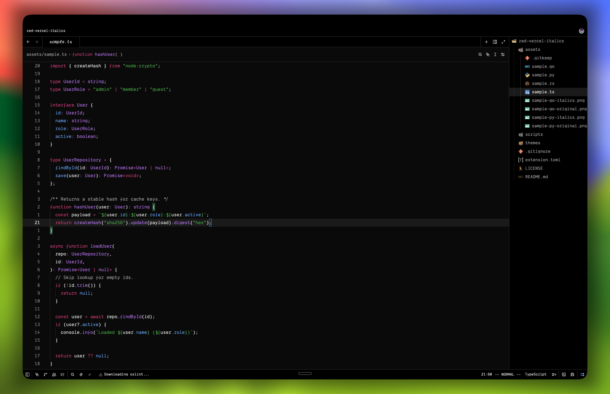
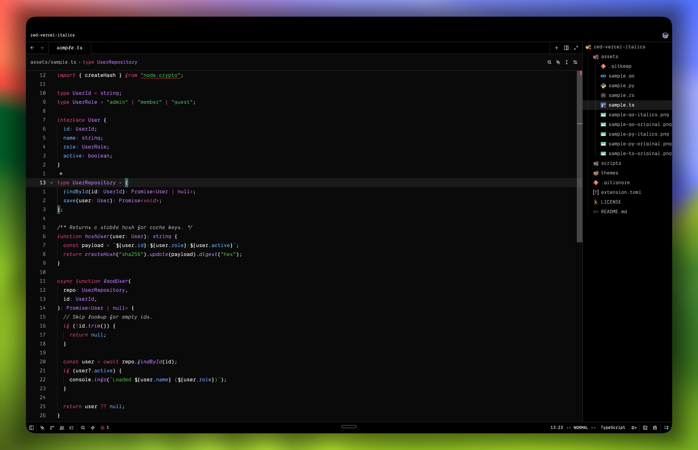
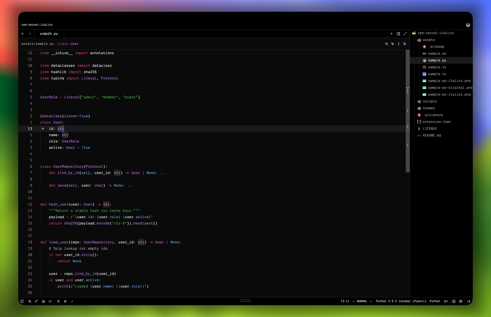
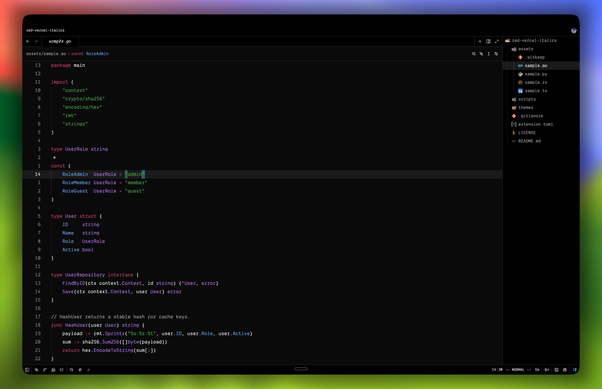
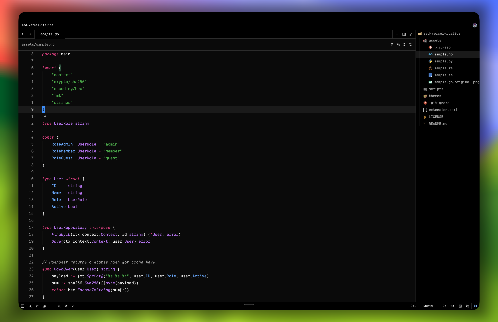
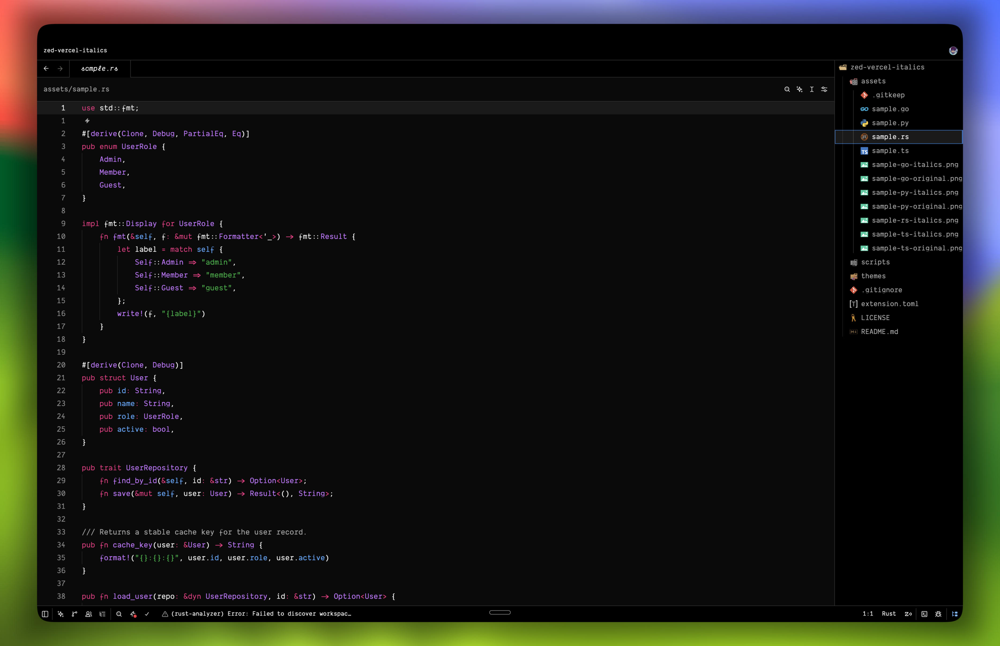
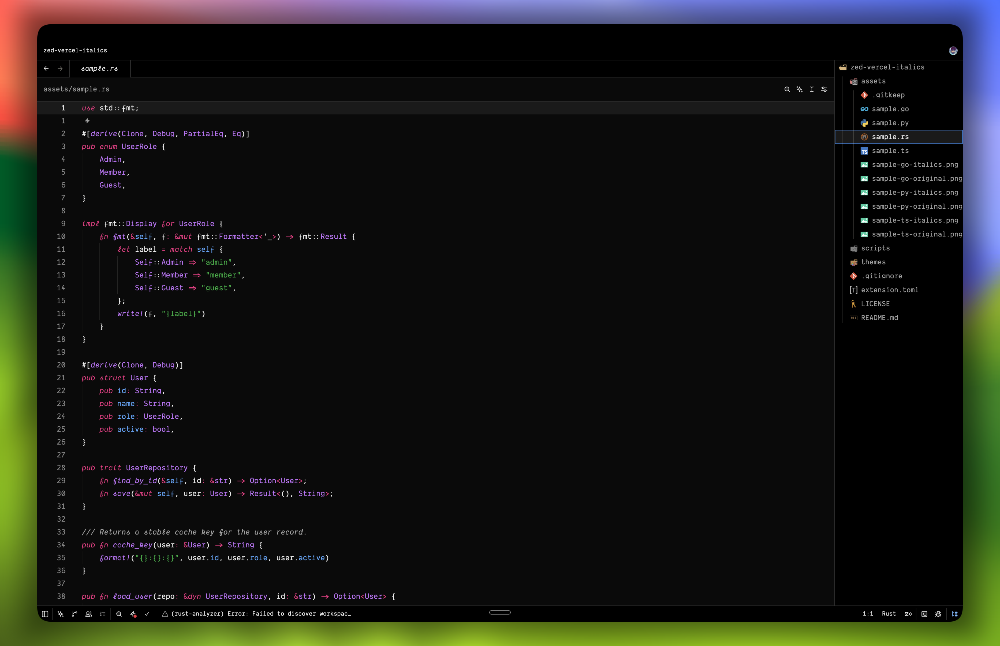

# Vercel Italics

Vercel light and dark themes for [Zed](https://zed.dev), with Night Owl-style italic syntax highlighting.

Colors and UI match [zed-vercel-theme](https://github.com/NathanBrodin/zed-vercel-theme). Italic rules come from [night-owlz](https://github.com/elGusto/night-owlz).

Includes **Vercel Italics Dark** and **Vercel Italics Light**.

Install **Vercel Italics** from the extensions panel in Zed.

## Comparison

### TypeScript

| Vercel Theme | Vercel Italics |
| :--: | :--: |
|  |  |

### Python

| Vercel Theme | Vercel Italics |
| :--: | :--: |
|  |  |

### Go

| Vercel Theme | Vercel Italics |
| :--: | :--: |
|  |  |

### Rust

| Vercel Theme | Vercel Italics |
| :--: | :--: |
|  |  |

## Credits

- [Vercel Theme for Zed](https://github.com/NathanBrodin/zed-vercel-theme) by Nathan Brodin
- [Night Owl for Zed](https://github.com/elGusto/night-owlz) by Auguste Bercovici
- [Night Owl for VS Code](https://github.com/sdras/night-owl-vscode-theme) by Sarah Drasner

## License

MIT. See [LICENSE](./LICENSE).
